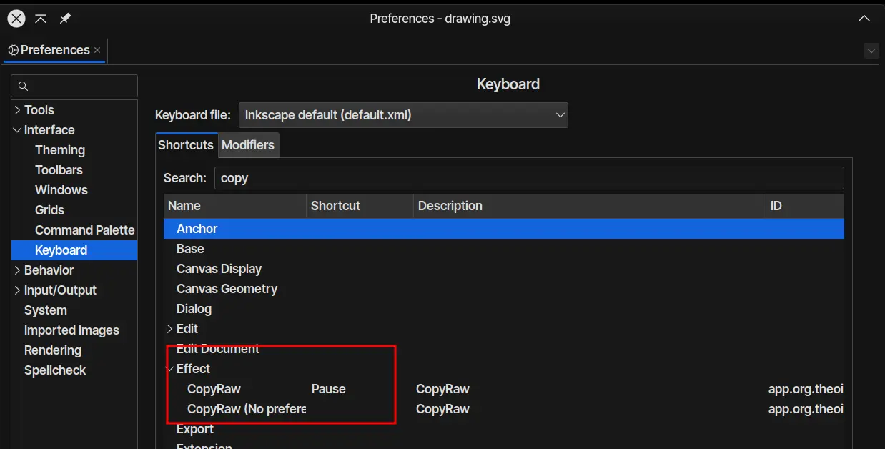

<h1 align="center">CopyRaw</h1>


https://github.com/TheoIsDumb/CopyRaw/assets/118801625/6b7a2211-5798-428e-8d63-e073b74f11ea


(dialog box looks like an error box due to inkex.utils.debug() being used)


An Inkscape Extension I made for myself.

Copies raw SVG directly instead of saving it as an optimized SVG, then opening it in a text editor, Ctrl-a + Ctrl-c, you know all of that stuff. 

## How to use

1. Select paths/strokes/whatever.
2. Go to `Extensions -> Custom -> CopyRaw.`
3. Copy the SVG text from the box that pops up. (inkex.utils.debug())

## Installation

```
cd ~/.config/inkscape/extensions # or wherever you store extensions, dunno about windows/mac
git clone https://github.com/TheoIsDumb/CopyRaw
```

Open Inkscape (re-launch if already open) and CopyRaw will be available in the Extensions menu.

## ProTip 



> Set a keyboard shortcut for CopyRaw in Edit -> Preferences -> Interface -> Keyboard. 
> (I used Pause, cause I never use it.)
